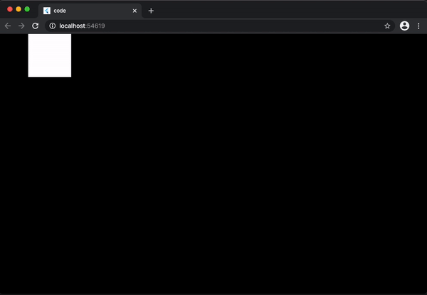

# Basic: Rendering a simple square on the screen

This tutorial will introduce you to:

 - `Game`: The basic class to build a game on, you will understand its structure and how to use it to build a simple game
 - `GameWidget`: The widget used to place your game on your widget tree
 - Basic rendering: You will get introduced to the basics of using `dart:ui` class `Canvas` which is the class which Flame uses for rendering your game.

All the code of this tutorial code can be found [here](./code) and is based on Flame `1.0.0-rc7` version.

By the end of this tutorial you will have built a simple game that renders a square bouncing on the screen that will look like this:



## Building your first game

`Game` is the most basic class that you can use to build your game, it includes the necessary methods for creating a basic game loop and methods for the lifecycle of a Flame game.

`GameWidget` is, like its name suggest, a Flutter widget that will run your game and place it inside the Flutter widget tree.

As a first step, lets just put a Game instance running, for that we will need to create our own class that extends Flame's Game class, implement its methods, and pass an instance of that Game to a GameWidget, something like this:

```dart
import 'package:flutter/material.dart';
import 'package:flame/game.dart';

void main() {
  runApp(GameWidget(
    game: MyGame(),
  ));
}

class MyGame extends Game {
  @override
  void update(double dt) { /* TODO */ }
 }

  @override
  void render(Canvas canvas) { /* TODO */ }
}
```

That is it, you should see just an empty black screen for now, but now we have the bare bones needed to start implementing our game.

Before going further, it is important to explain what those two methods mean.

Flame's `Game` class is an implementation of a Game Loop, which the basic structure on which basically all games are built on. It is called Game Loop because it really works a an infinite loop that continues to iterate as long as the game is running. This loop can be divided on some steps:

 - 1: Take input from the player
 - 2: Process the logic for the next frame
 - 3: Render the frame.

On this tutorial we will focus the steps two and three.

To process the logic of the game, we use the `update` method, which is ran always before the frame is rendered and receives a single argument, a `double` value called `dt` (delta time), which is the ammout os seconds from the current iteration and the last one. This delta time is very important so we can always know how to correct calculate movement, animations and etc.

To render the frame, we use the `render` method, this method receives a single argument which is an instance of a `dart:ui` `Canvas` class. With that instance we can basically render anything we want. It is important to not that in this method, we should only contain render logic, any game logic should be put in the `update` method.

Now that we have a better understanding of how the game structures works, lets start to plan our game.

First things first, lets think on what variables and data structure we would need. For that, lets recap what we are building: A simple game where a square keeps bouncing forever from one side of the screen to the other. Thinking on this, we will need:

 - A variable to tell us the speed of the square in logical pixels per second.
 - A variable to inform which direction the square is moving.
 - A structure to represent our square, which has a position and dimensions.

With that in mind, check the example below, note the comments for explanations on which code section.


```dart
class MyGame extends Game {
  // A constant speed, represented in logical pixels per second
  static const int square_speed = 400;

  // To represent our square we are using the Rect class from dart:ui
  // which is a handle class to represent this type of data. We will be
  // seeing other types of data classes in the future, but for this
  // example, Rect will do fine for us.
  late Rect squarePos;

  // To reprent our direction, we will be using an int value, where 1 means
  // going to the right, and -1 going to the left, this may seems like a too much
  // simple way of representing a direction, and indeed it is, but this will
  // will work fine for our small example and will make more sense when we implement
  // the update method
  int squareDirection = 1;

  // The onLoad method is where all of the game initialization is supposed to go
  // for this example, you may think that this square could just be initialized on the field
  // declaration, and you are right, but for ludic reasons and to present the life cycle method
  // for this example we will be initializing this field here.
  @override
  Future<void> onLoad() async {
    squarePos = Rect.fromLTWH(0, 0, 100, 100);
  }

  // Update and render ommited
}
```

Right, now we have all the data and variables we need to start implementing our game, for the next step, lets just draw our little square on the screen.

```dart
  @override
  void render(Canvas canvas) {
    // Canvas is a class from dart:ui and is reponsible for all the renderizations on Flame
    //
    // BasicPalette is a help class from Flame, which provides default, pre builded instances
    // of Paints that can be used by your game
    canvas.drawRect(squarePos, BasicPalette.white.paint);
  }
}
```

You may now be seeing a static white square being rendered on the top left corner of your screen, which is not that cool, so, to finish our example, lets add some movement to the game and implement our update method:

```dart
  @override
  void update(double dt) {
    // Here we move our square by applying our iteration delta time (dt) to our
    // speed variable and direction. Note that the Rect class class is immutable
    // and the translate method returns a new Rect instance for us, so we just
    // re assign it to our square variable
    squarePos = squarePos.translate(square_speed * squareDirection * dt, 0);

    // This simple verifies if the square is going right, and has reached the end of the screen
    // if so, we just invert our direction
    if (squareDirection == 1 && squarePos.right > size.x) {
      squareDirection = -1;
    // This does the same, but now checking the left direction
    } else if (squareDirection == -1 && squarePos.left < 0) {
      squareDirection = 1;
    }
  }
```

And that is it for this basic tutorial, here we have covered the basics of Flame, its basic classes and some basic rendering. From that we can start to build more complex things and more "exciting" games.
